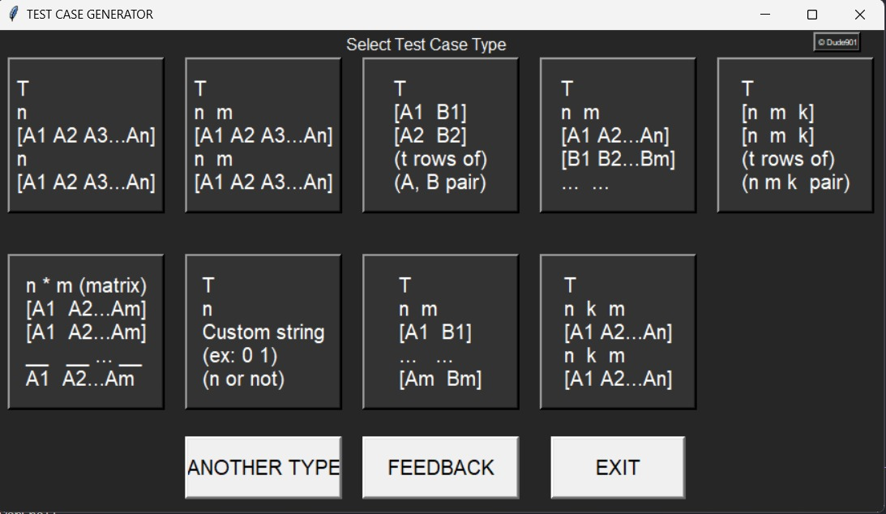
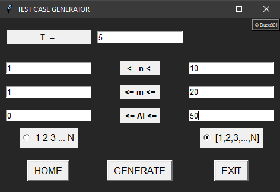
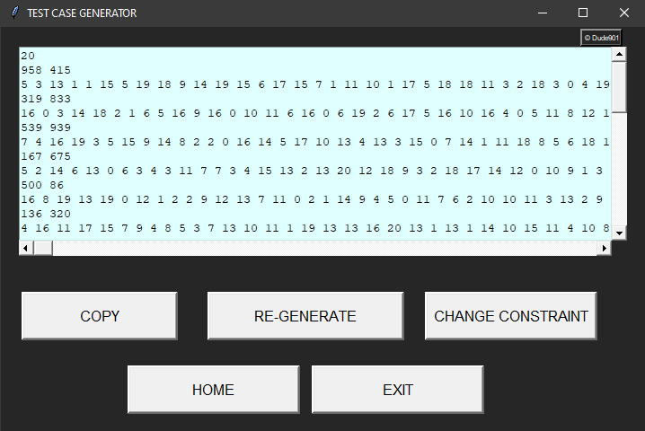
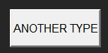

# Test-case-generator  
#### Generate test cases for Competitive Coding ->  [python code](https://github.com/Tanmay-901/test-case-generator/blob/master/final_release/test_case.py) / [Zip file](https://github.com/Tanmay-901/test-case-generator/raw/master/test_case.zip)
-------------------------------

    <a href="https://github.com/Tanmay-901/test-case-generator/blob/master/public/README.md">Detailed Instructions</a>
    ·
    <a href="https://github.com/Tanmay-901/test-case-generator/issues/new/choose">Report Bug</a>
    ·
    <a href="https://github.com/TryShape/Tanmay-901/test-case-generator/new/choose">Request Feature</a>

# 👋 Introducing `Test Case Generator`

        
    </a>

`Test Case Generator` is an opensource tool to create Test cass of desired type to use in Competitive coding using a simple, easy-to-use interface. You can create arrays, strings, char patterns and use a variety of handy features like copy, regenerate, change constraints.

Liked it? Please give a ⭐️ to <b>Test Case Generator</b> to build its community stronger.

## 🙏 Many Thanks to all the `Stargazers` who has supported this project with stars(⭐)

---

# 🔥 Features
`Test Case Generator` comes with a bundle of features already. You can do the followings with it,
## ✨ Select space separated / comma separated format

        

## 🎿 Copy
 - No need to manually copy the output, simply use this button

## 🔢 Regenerate
 - Generate test cases again and again for the given constraints with single click.

## 🏗️ Change constraints
 - Directly go to the constraints screen to make a quick change in constraints

        

## 📢 Suggest more test case formats
- You can get more test cases added by creating a test case addition request.

        

# 🍔 Built With
- [Python](https://python.org/): High-level general-purpose programming language
- [Tkinter](https://docs.python.org/3/library/tkinter.html): Standard Python interface to the Tk GUI toolkit

# 🛡️ License
This project is licensed under the GNU GPLv3 License - see the [`LICENSE`](LICENSE) file for details.

# 🦄 Upcoming Features
`Test Case Generator` has all the potentials to grow further. Here are some of the upcoming features planned(not in any order),

- ✔️ Support for Test cases for larger constraint values is being worked upon.
- ✔️ New test case types are being added on request.
- ✔️ Graphs, Trees, Linked-list are on open for contributions

If you find something is missing, `Test Case Generator` is listening. Please create a feature request [from here](https://github.com/Tanmay-901/test-case-generator/issues/new/choose).

# 🤝 Contributing to `Test Case Generator`
Any kind of positive contribution is welcome! Please help us to grow by contributing to the project.

If you wish to contribute, you can work on any features [listed here](https://github.com/Tanmay-901/test-case-generator#-upcoming-features) or create one on your own. After adding your code, please send us a Pull Request.

> Please read [`CONTRIBUTING`](CONTRIBUTING.md) for details on our [`CODE OF CONDUCT`](CODE_OF_CONDUCT.md), and the process for submitting pull requests to us.

## 💘 Support project
- Currently we are not taking financial support but you can support us by sharing the project with your collleagues if you liked the project.

We all need support and motivation. `Test Case Generator` is not an exception. Please give this project a ⭐️ to encourage and show that you liked it. Don't forget to leave a star ⭐️ before you move away.

---

<h3 align="center">
A ⭐️ to <b>Test Case Generator</b> is to build its Use Case 💪 stronger.
</h3>
